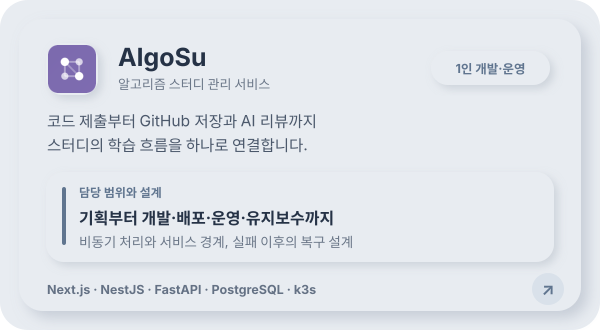
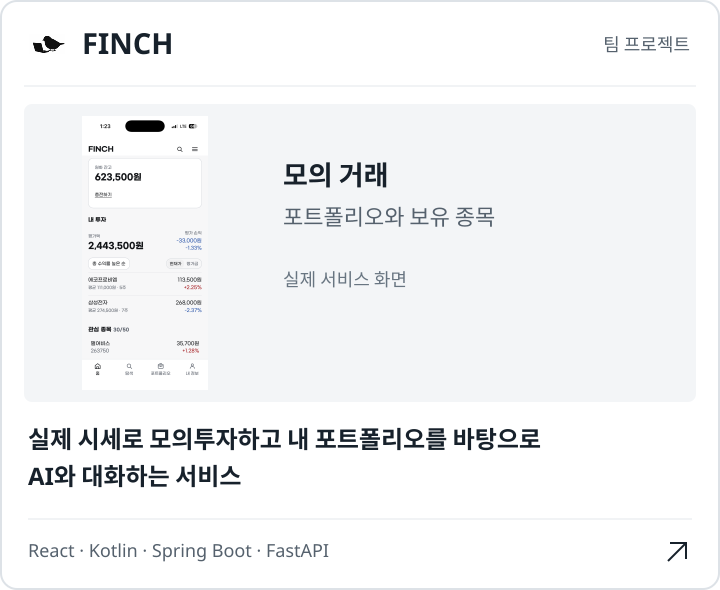
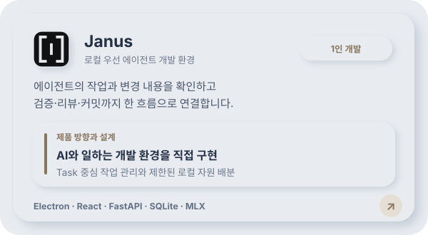
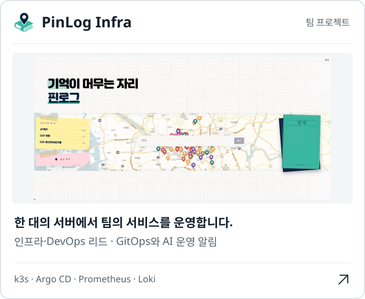
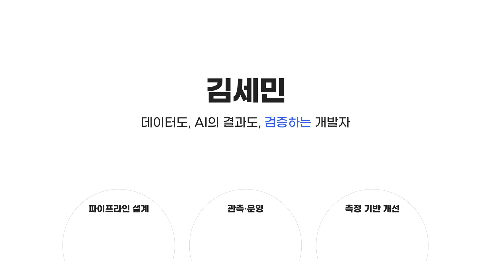

# 김세민 | AI Native Builder

**AI와 함께 제품을 만들고, 운영하며 개선하는 개발자입니다.**

문제를 정의하고 AI에 역할을 나누어 맡기며, 구현 결과를 검증해 실제 서비스로 연결합니다. AlgoSu는 기획부터 개발, 배포, 운영과 유지보수까지 혼자 맡고 있습니다. 서비스 개발 경험을 바탕으로 AI와 일하는 개발 도구와 운영 환경도 만들고 있습니다.

## 대표 프로젝트

각 카드를 선택하면 프로젝트 설명, 화면, 아키텍처와 개발 기록을 볼 수 있습니다.

## 포트폴리오

33장 · AlgoSu · PinLog · Janus · FINCH — 개요 · 아키텍처 · 기술 사용 이유 · 시나리오 · 트러블슈팅 · 회고 (2026.09 기준)

## AI와 일하는 방식

**문제 정의 → 역할 분담 → 구현 → 검증 → 배포 → 운영에서 개선**

- **문제와 우선순위는 직접 정합니다.** 사용자 경험과 제약을 바탕으로 만들 범위와 성공 기준을 정합니다.
- **AI가 맡을 범위를 구체화합니다.** 파트별 책임, API 계약과 파일 소유권을 정하고 필요한 맥락을 전달합니다.
- **결과는 코드와 실행으로 확인합니다.** 변경 diff, 테스트와 빌드를 검토하고, 실기기 QA와 운영 상태로 실제 동작을 확인합니다.
- **시행착오를 다음 작업에 반영합니다.** 설계 결정과 문제 해결 과정을 기록하고, 반복되는 오류는 검증 절차와 자동화로 보완합니다.

## 기술 스택

### 언어

  &nbsp;
  &nbsp;
  &nbsp;

TypeScript · Python · Kotlin

### 웹·백엔드·데스크톱

  &nbsp;
  &nbsp;
  &nbsp;
  &nbsp;
  &nbsp;
  &nbsp;

React · Next.js · NestJS · Spring Boot · FastAPI · Electron

### AI·데이터

  &nbsp;
  &nbsp;
  &nbsp;

PostgreSQL · Redis · SQLite

### 배포·운영

  &nbsp;
  &nbsp;
  &nbsp;
  &nbsp;
  &nbsp;
  &nbsp;

Docker · Kubernetes · GitHub Actions · Argo CD · Prometheus · Grafana

## 개발 기록

- [AlgoSu — 서비스 설계와 개발 기록](https://github.com/tpals0409/AlgoSu/tree/HEAD/blog/content/posts)
- [FINCH — 스프린트별 의사결정과 회고](https://github.com/tpals0409/FINCH/tree/master/docs/adr/sprints)
- [Janus — 실험 조건과 검증 근거](https://github.com/tpals0409/Janus/blob/main/V1_AUDIT.md)
- [PinLog Infra — 배포와 운영 설계](https://github.com/Team-PinLog/infra/blob/main/docs/architecture.md)

<!-- 연락처가 정해지면 추가합니다. -->
