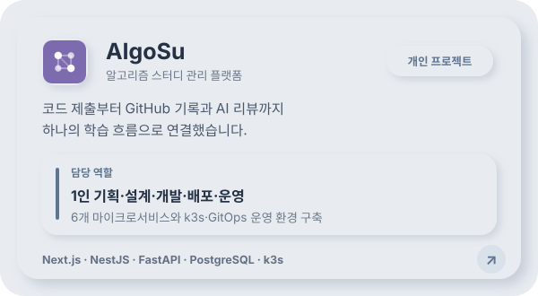
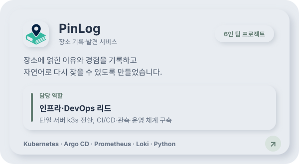
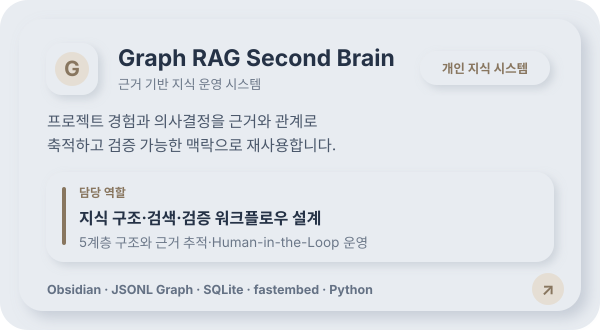
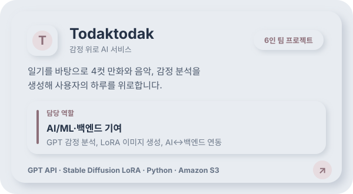

<!-- GitHub 프로필 대시보드 -->

# 김세민 | Leo.Kim

**사용자가 실제로 쓰는 AI 서비스를 만들고 운영하는 개발자입니다.**

## 기술 스택

### 서비스 개발

### AI·데이터

### 운영·자동화

## 프로젝트 대시보드

## GitHub 활동

<picture>
  <source media="(prefers-color-scheme: dark)" srcset="https://raw.githubusercontent.com/tpals0409/tpals0409/output/github-activity-dashboard-dark.svg" />
  <source media="(prefers-color-scheme: light)" srcset="https://raw.githubusercontent.com/tpals0409/tpals0409/output/github-activity-dashboard.svg" />
  
</picture>

---

프로젝트 카드를 선택하면 저장소 또는 상세 포트폴리오로 이동합니다.

