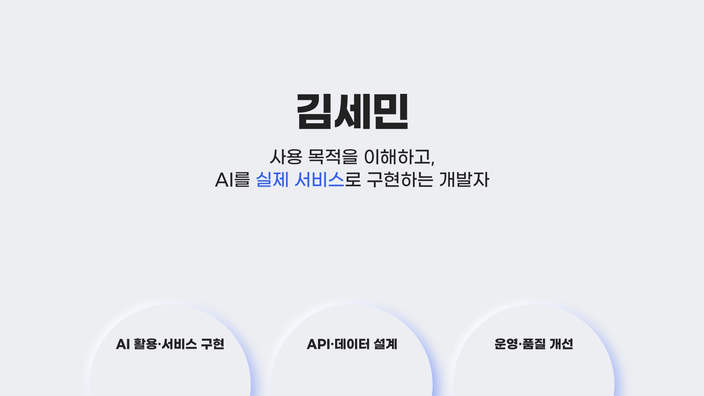
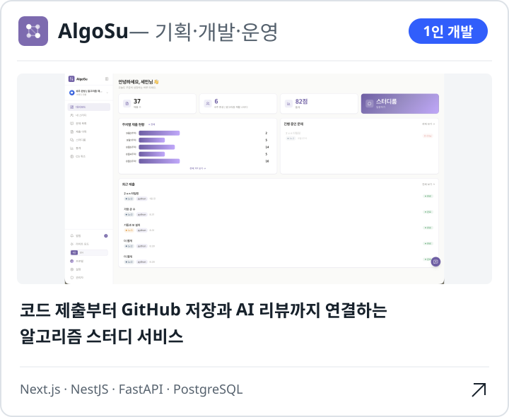
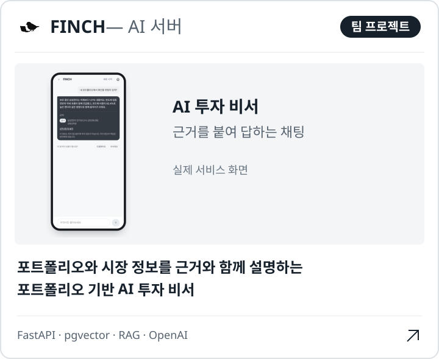
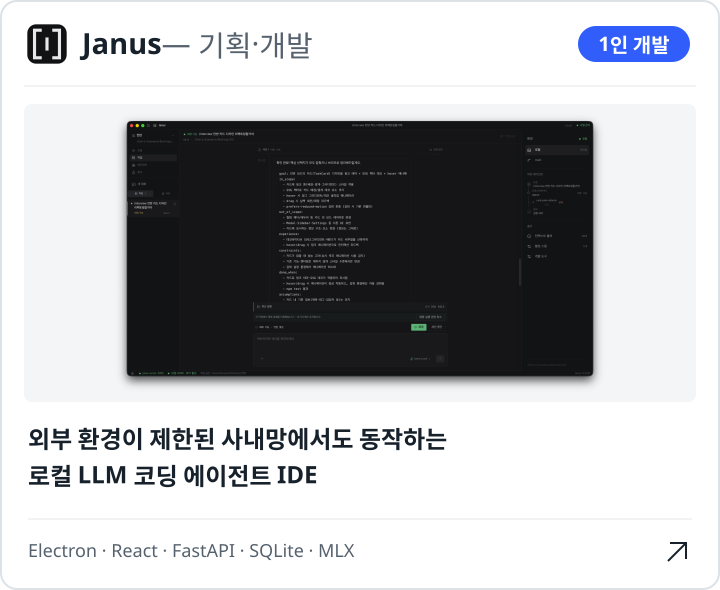
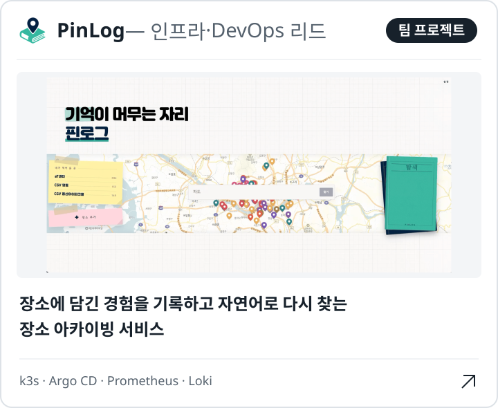

# 김세민 | AI 서비스를 만들고 운영하는 개발자

**문제를 정의하고, AI와 역할을 나눠 검증 가능한 제품으로 구현합니다.**

성공 기준과 책임 범위를 먼저 정하고, AI 에이전트에는 필요한 맥락과 작업 단위를 구체적으로 맡깁니다. 설계와 우선순위, 최종 검증은 직접 책임집니다. 코드와 테스트, 실제 동작을 확인하고, 운영에서 얻은 피드백을 다음 개선에 반영합니다.

## 포트폴리오

## 대표 프로젝트

각 카드를 선택하면 프로젝트 설명, 화면, 아키텍처와 개발 기록을 볼 수 있습니다.

## 기술 스택

### 언어

  &nbsp;
  &nbsp;

### 웹·백엔드·데스크톱

  &nbsp;
  &nbsp;
  &nbsp;
  &nbsp;
  &nbsp;

### 데이터

  &nbsp;
  &nbsp;
  &nbsp;

### 배포·운영

  &nbsp;
  &nbsp;
  &nbsp;
  &nbsp;
  &nbsp;
  &nbsp;

## 개발 기록

- [AlgoSu — 서비스 설계와 개발 기록](https://github.com/tpals0409/AlgoSu/tree/HEAD/blog/content/posts)
- [FINCH — AI 기능 설계와 검증](https://github.com/Team-FINCH/finch-ai/blob/master/docs/ai-feature-report.md)
- [Janus — 실험 조건과 검증 근거](https://github.com/tpals0409/Janus/blob/main/V1_AUDIT.md)
- [PinLog Infra — 배포와 운영 설계](https://github.com/Team-PinLog/infra/blob/main/docs/architecture.md)
